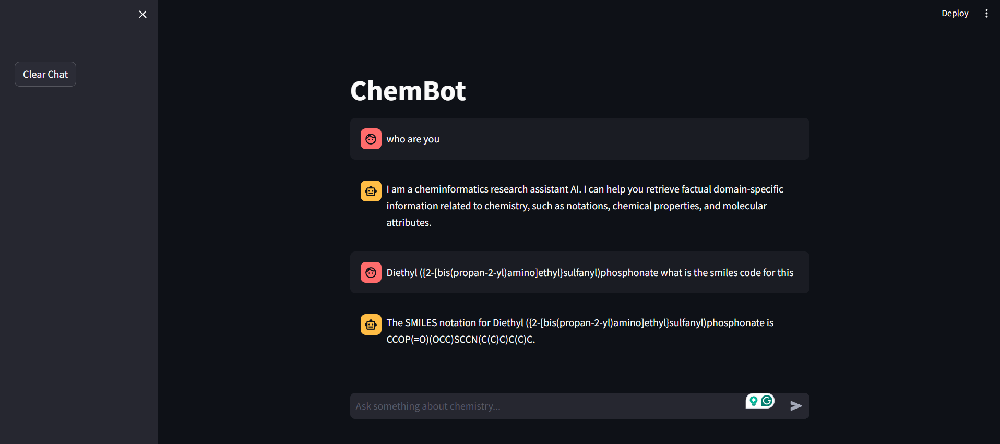

# Chembot: AI-Powered Agentic LLM Chatbot



Chembot is an AI-powered agentic AI chatbot designed to assist drug researchers with complex chemical and molecular queries. It leverages GPT-4o-mini for language inferencing, LangGraph for agentic framework, and RDKit frameworks to provide precise and insightful responses about molecular structures, properties, and drug-likeness.

## Features

### Molecular Analysis

- **Molecular Identification**: Retrieve the SMILES notation of a molecule using its common name via the PubChem API.
- **Descriptor Calculation**: Compute key molecular descriptors such as:
  - Molecular Weight
  - LogP
  - Number of Rotatable Bonds
  - Number of Hydrogen Acceptors/Donors
  - TPSA (Topological Polar Surface Area)
  - Number of Rings & Aromatic Rings

### Drug Discovery Support

- **Drug-likeness Evaluation**: Check a molecule’s compliance with **Lipinski's Rule of Five**.
- **Fingerprint Generation**: Generate molecular fingerprints for similarity and substructure screening.
- **Molecule Similarity**: Compare molecules using various similarity metrics.
- **Substructure Matching**: Identify substructure patterns in molecules.

### Advanced Molecular Insights

- **3D Structure Generation**: Generate 3D coordinates from SMILES notation.
- **Reaction Prediction**: Predict possible reactions using SMARTS reaction templates.
- **Scaffold Analysis**: Analyze the molecular scaffold and extract core structure details.
- **Formula Retrieval**: Retrieve the molecular formula from SMILES notation.

## Installation

Ensure you have Python installed, then install the required dependencies:

```sh
pip install -r requirements.txt
```

## create .env file with openai api key:

```sh
OPENAI_API_KEY="<your api key>"
```

## Running the Application

To start the backend API:

```sh
python -m uvicorn backend.main:app --reload
```

To launch the frontend interface:

```sh
streamlit run frontend/app.py
```

## Technologies Used

- **Streamlit**: For the interactive web UI.
- **LangChain**: For AI-powered natural language processing.
- **RDKit**: For molecular computations and chemical informatics.
- **Openai**: for language inferencing


---

Developed with 💡 for Drug Researchers

